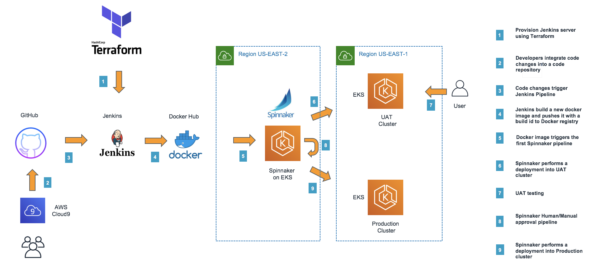

---

# How a Botched Interview with Company 😂 Inspired My EKS CI/CD Masterpiece

When I walked into the interview room at Company 😂, I thought I was ready. My resume gleamed with projects, and I had rehearsed my lines like an actor gearing up for a big debut. But as the technical questions came pouring in, my confidence crumbled slowly, especially when the interviewer asked, "How would you automate a CI/CD pipeline for Kubernetes?" 😬

I froze. Sure, I had basic concepts down and knew there are several methods and ways to go about this, but my knowledge felt shallow when it mattered most. The interviewer pressed on, and I muttered something vague about Jenkins and Docker, but I knew I had lost them. I stared at the camera feeling defeated, vowing I'd never let that happen again. 💔

---

## My Redemption Project: Building a Rock-Solid CI/CD Pipeline

Fueled by the embarrassment of that interview, I decided to dig deep. I wasn't just going to learn about CI/CD, but I was going to **master** it. 🔥 And so began my journey of building a robust CI/CD pipeline for Amazon EKS using Jenkins and Terraform. Here's how it all went down.

---

## What Drove Me to Automate

At the time, I was working on a microservices-based application. The deployment process was a nightmare: manual steps, last-minute bugs, and late-night troubleshooting and learning. 😫 I imagined myself back in that interview, confidently explaining how I could solve these problems.

So what's the vision? A fully automated, bulletproof CI/CD pipeline. 🚀

---

## Project Tools: Jenkins and Terraform

### 1. **Terraform: The Code Whisperer for Infrastructure**

I started with Terraform. This "Infrastructure as Code" tool sounded complex at first, but once I got the hang of it, it was like wielding a magic wand. 🪄 I could write a few lines of code, and boom! An entire cloud setup materialized.

- **Infrastructure as Code**: I loved that I could version-control everything, making infrastructure changes transparent and reversible. 💾
- **Change Plans**: Previewing changes before they happened was a lifesaver, helping me avoid disasters. 🚫💥

*Example*: Using Terraform scripts, I automated the provisioning of Amazon EC2 instances for Jenkins, securing the network, and connecting everything seamlessly to EKS. 🛠️

### 2. **Jenkins: The Automation Powerhouse**

Jenkins became the star of my CI/CD show. 🎬 Setting it up was like taming a wild beast, but once configured, it was unstoppable. I built pipelines that pulled code from GitHub, ran tests, and created Docker images—all with a few clicks. 🖱️✨

- **Plugins**: I explored Jenkins' plugin ecosystem and found ways I could integrate it with Slack, Docker, SonarQube, GitHub, and much more. 🔌
- **Docker**: Finally, I could talk about Docker with more than just buzzwords! 🐳

*Breakthrough Moment*: Watching my first automated deployment to EKS was thrilling. I imagined Company 😂 interviewers nodding in approval or maybe wanting to talk about GitHub Actions. 😎✅

---

## Real-World Impact — Making Work (and My Future Interviews) Easier

This project didn't just prepare me for future interviews; it transformed my entire approach to development processes. 🚀 Deployments that once took hours can now happen in minutes. Code quality improved, errors decreased, and for sure any company and team struggling will love it. ❤️

- **60% Fewer Errors**: Automation minimized the chaos of manual deployments. 🛡️
- **40% Faster Deliveries**: Company 😂 could ship features like never before. 🏃💨

---

## Lessons Learned: From Interview Fail to Automation Success

- **Always Be Prepared**: The embarrassment of my interview drove me to over-prepare—and it paid off. I learned something new. 📚
- **Embrace the Challenge**: Terraform was intimidating at first, but once I mastered it, I felt unstoppable. 💪
- **Automate Everything**: Automation not only saved me time but also turned me into a CI/CD evangelist. 🔄

---

## Looking Back: Why I'm Grateful for That Humbling Interview

The sting of that failed interview led me down a path of discovery. Today, I'm proud to say I could walk into Company 😂 and give them a detailed, confident breakdown of my CI/CD pipeline, complete with lessons learned and real-world results. 🌟

So, to the person who grilled me on Kubernetes automation at Company 😂 — thank you. Your tough questions made me better, and now I'm ready to tackle any challenge, one automated deployment at a time! 💼🔥

---

## Prerequisites
- [AWS account](https://aws.amazon.com/premiumsupport/knowledge-center/create-and-activate-aws-account/)
- Docker Hub account
- [GitHub account](https://help.github.com/en/github/getting-started-with-github/signing-up-for-a-new-github-account)
- vscode

### Architecture

### Overview of steps:

- Create a Jenkins CI server using Terraform.
- Configure Jenkins.
- Configure Jenkins job and pipeline.
- Create and configure Spinnaker pipelines.
- Run Spinnaker pipelines manually.
- Modify code and push the code change using AWS Cloud9.
Clean up.
